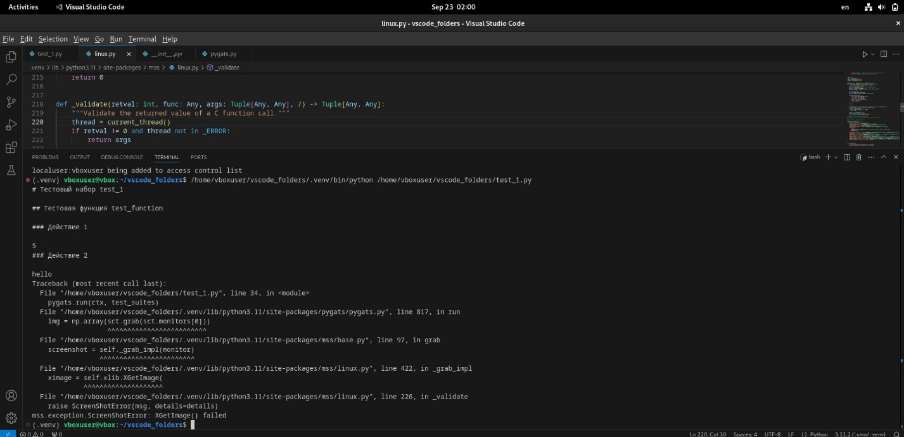

# Running MSS under WAYLAND reveals an error 

## Description of the problem:
An error occurs when selecting Wayland during the login screen and using the MSS library

## Description of the configuration to reproduce the problem:
To use pyGATs, you had to install Linux. The virtual machine was configured as follows:

- OS name : Debian GNU/Linux 12(bookworm)
- OS type: 64-bit
- Windowing system: Wayland
- RAM: 2679 MB
- Processors: 2
- Boot Order: Hard Disk, Optical Disk, Floppy Disk
- Acceleration: Nested Paging, KVM Paravirtualization
- Video memory: 128 MB
- Graphics Controller: VMSVGA
- Remote Display Server: Turned off
- Recording: Disabled

## Description of the steps reproducing the problem:
VS code and pyGATs were installed. The library contained the following package versions:

- colorama 0.4.6
- Levenshtein 0.25.1
- MouseInfo 0.1.3
- mss 9.0.2
- numpy 2.1.1
- opencv-python 4.10.0.84
- packaging 24.1
- pillow 10.4.0
- pip 23.0.1
- PyAutoGUI 0.9.54
- pyGATs 0.1.0
- PyGetWindow 0.0.9
- PyMsgBox 1.0.9
- pyperclip 1.9.0
- PyRect 0.2.0
- PyScreeze 1.0.1
- pytesseract 0.3.13
- python3-xlib 0.15
- pytweening 1.2.0
- PyYAML 6.0.2
- rapidfuzz 3.9.7
- setuptools 66.1.1

An error occurs when running the test code :


## Attempts to solve the problem:
1. The following code was written to check the monitor configuration. In case of an incorrect result, it could be concluded that mss does not see it, or it may be unavailable, or it may not exist at all due to incorrect configuration.
```
    import mss
    with mss.mss() as sct:
        print(sct.monitors)
```
Example output:
```
    [{'left': 0, 'top': 0, 'width': 1920, 'height': 935}, {'left': 0, 'top': 0, 'width': 1920, 'height': 935}]
```
Bottom line: When running the file with the code, the error was not fixed.

2. The X server was checked for operation. The echo $DISPLAY command was registered
This command should return a value (for example :0) indicating an active display. If it does not return anything, it means that the X server is not running.
Bottom line: When running the file with the code, the error was not fixed.

3. Changed the version of the MSS package
Since the problem area was the use of mss functions, I tried to change the version of the installed library from 9.0.2 to 9.0.1 And executed the commands:
```
    pip uninstall mss
    pip install mss==9.0.1
```
to verify the installation, it is recommended to run the following command:
```
    pip show mss
```
Bottom line: When running the file with the code, the error was not fixed.


## The solution to the problem
The following steps have fixed the bug :
You need to go to the settings of the GDM3 display manager (GNOME Display Manager).
##
    sudo nano /etc/gdm3/daemon.conf
This configuration file is used to change various GDM3 operation parameters. In it, you need to uncomment the line specified below to force the login screen to use Xorg, and restart the system
##
    WaylandEnable=false
After the reboot, the error disappeared, and the code of the test program was executed correctly.
!!! Features 
    First of all, it is worth paying attention to the code of the MSS itself: [Github:python-mss](https://github.com/BoboTiG/python-mss/blob/main/src/mss/linux.py).
    The thing is that currently MSS uses a structure that connects to the X server and contains all the information about it. This library was developed specifically for X. Wayland is not the display server itself, but a protocol for organizing a graphics server. The library code tried to connect to Xorg, but it couldn't do it.